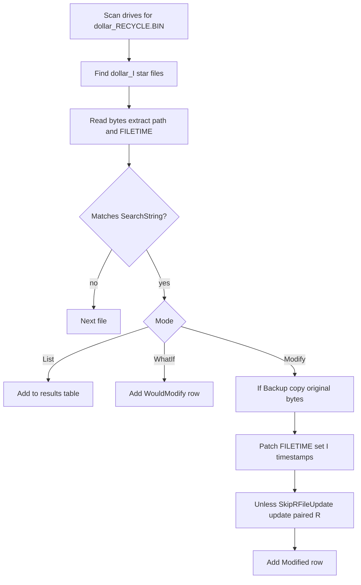

# ModifyRecycleBin.ps1

## Overview

PowerShell script that **lists** or **modifies** deletion timestamps for items in the Windows Recycle Bin. It scans `$RECYCLE.BIN` on all drives, matches `$I*` metadata files by filename or original path (wildcards supported), and can update:

- Internal `FILETIME` (deletion time) inside `$I*`
- `$I*` `LastWriteTime` and `CreationTime`
- Paired `$R*` timestamps (default; disable with `-SkipRFileUpdate`)

Optional `-Backup` copies original `$I*` bytes before writing. Use `-WhatIf` to preview and `-List` to inspect. Run as Administrator.

## Features

- Wildcard search (`*`, `?`), case-insensitive, path normalization
- `-List` — report matches and current deletion times
- `-WhatIf` — dry-run with no writes
- Default paired `$R*` timestamp update; `-SkipRFileUpdate` to skip
- Optional `-Backup` / `-BackupPath` for original `$I*` bytes
- Incomplete `NewDeletionTime` values get missing parts randomized
- `-Silent` suppresses output

## How it works



## Requirements

- Windows (tested on Windows 10+)
- PowerShell 5.1+
- Administrative privileges

## Usage

Elevated PowerShell:

```powershell
# Modify
.\ModifyRecycleBin.ps1 -SearchString <string> -NewDeletionTime <string> [-Silent] [-SkipRFileUpdate] [-Backup] [-BackupPath <path>] [-WhatIf]

# List
.\ModifyRecycleBin.ps1 -SearchString <string> -List [-Silent]
```

| Parameter | Description |
|-----------|-------------|
| `-SearchString` | Filename or path pattern |
| `-NewDeletionTime` | Local deletion time (Modify / WhatIf) |
| `-List` | List matches only |
| `-WhatIf` | Dry-run |
| `-Silent` | No console output |
| `-SkipRFileUpdate` | Do not update paired `$R*` |
| `-Backup` | Backup `$I*` bytes before modify |
| `-BackupPath` | Backup root (default under `.\RecycleBinBackups\<timestamp>\`) |

## Examples

1. **List matches**

```powershell
.\ModifyRecycleBin.ps1 -SearchString "*.txt" -List
```

2. **Dry-run**

```powershell
.\ModifyRecycleBin.ps1 -SearchString "example.txt" -NewDeletionTime "2025-09-03 17:00:00" -WhatIf
```

3. **Modify with backup**

```powershell
.\ModifyRecycleBin.ps1 -SearchString "example.txt" -NewDeletionTime "2025-09-03 17:00:00" -Backup
```

4. **Modify `$I*` only**

```powershell
.\ModifyRecycleBin.ps1 -SearchString "notes.txt" -NewDeletionTime "2025-09-03 17:00:00" -SkipRFileUpdate
```

5. **Wildcard path + silent**

```powershell
.\ModifyRecycleBin.ps1 -SearchString "C:\Users\*\Documents\*.txt" -NewDeletionTime "2025-09-03" -Silent
```

## Documentation

Full docs: [docs/index.md](docs/index.md)

- [Getting started](docs/getting-started.md)
- [Installation](docs/installation.md)
- [Usage](docs/usage.md)
- [Architecture](docs/architecture.md)
- [CHANGELOG.md](CHANGELOG.md) · [CONTRIBUTING.md](CONTRIBUTING.md)

## Troubleshooting

- **No matches** — Align `-SearchString` with “Original location” in Recycle Bin; try `-List` first.
- **Permissions** — Run as Administrator; check warnings unless `-Silent`.
- **Timestamps** — Confirm with Recycle Bin UI and `Get-Item` on `$I*` / `$R*` under `$RECYCLE.BIN`.
- **Backup failed** — Fix path/permissions; the script skips modify for that file if backup fails.

## Contributing

See [CONTRIBUTING.md](CONTRIBUTING.md).
